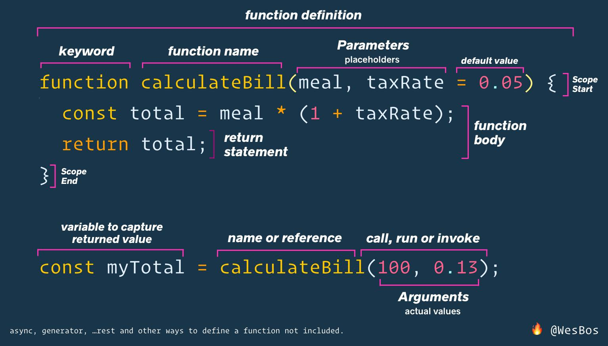

# Functions

[fetch get results from multiple URLs](https://codepen.io/matthewselby/pen/xxGGjjx?editors=0011)

[create a simple timout](https://codepen.io/matthewselby/pen/WNvrZJa?editors=0011)

[simple Dad Tax](https://codepen.io/matthewselby/pen/dyPNoPp)

## Functions - Built-in

## Functions - Custom Functions

```js

function sayHiTo(name = `Bob`) {
  return `Hello ${name}`;
}

console.log(sayHiTo());
console.log(sayHiTo(`mom`));

function doctorize(name = `Kent`) {
  return `Dr. ${name}`;
}

console.log(doctorize());
console.log(doctorize(`Phil`));

function yell(name = `angry`) {
  return `HEY ${name.toUpperCase()}!`;
}

console.log(yell());
console.log(yell(doctorize(`Jackson`)));

```

## Functions - Parameters and Arguments

Parameters are placeholders of data that your function expects. You may also set default values for your parameters when no argument is passed. Arguments is the data that you are passing to a function.



```js

function calculateTip(billAmount, tipRate = 0.20) {
  console.log(`Running calculateBill!`);
  const total = billAmount * (1 + tipRate);
  return total;
}

// pass in arguments
console.log(calculateTip(100, 0.13));

// to use a default parameter value, pass undefined in args
console.log(calculateTip(100, undefined));

```

## Different Ways to Declare Functions

A bunch of different ways to write functions in JS. JS functions are *First Class Citizens*.

### Function Declaration

```js
function doctorize(firstName) {
  return `Dr. ${firstName}`;
}
```

### Anonymous Function

```js
function (firstName) {
  return `Dr. ${firstName}`;
}
```

### Function Expression

```js
const doctorize = function(firstName) {
  return `Dr. ${firstName}`;
}
```

### Arrow Functions

```js
const doctorize = firstName => `Dr. ${firstName}`;

const inchToCM = inches => inches * 2.54;

const add = (a, b = 3) => a + b;

// need to return an object?
// ...probably best to not make this a one-liner
const makeABaby = (first, last) => ({ name: `${first} ${last}`, age: 0 });
```

### IIFE - Immediately Invoked/Run Function Expression

```js
(function() {
  console.log(`I'm running immediately!!`);
})
```

### Methods

A function that lives inside of a function. Given `console.log()`, `console` is the function and `log` is the method.

```js
const person = {
  name: `John Doe`,
  // Method
  sayHi: function() {
    console.log(`Hey ${this.name}.`);
  },
  // short hand Method
  yellHi() {
    console.log(`HEY ${this.name}!`);
  },
  // arrow function
  whisperHi: () => `hi this person's name, i'm whispering to you.`;
  // won't work as expected - this in arrow functions uses the parent scope instead of local scope
  whisperHi: () => `hi ${this.name}, i'm whispering to you.`;
}
```
### Callback Functions

[The Event Loop](https://dev.to/lydiahallie/javascript-visualized-event-loop-3dif)

Just a regular function but does something when something else is done. A function that gets passed into another function and is called by the browser in a later point in time.

```js
// quick callback
const button = document.querySelector(`.specialButton`);
// normal function/callback function
function handleClick() {
  console.log(`The button has been clicked!!`);
}
// event listener, waits for a click then call a function "run callback function"
button.addEventListener(`click`, handleClick)

// can also pass an anonymous function
buddon.addEventListener(`click`, function() {
  console.log(`The button was clicked to trigger this anonymous function!`);
});

// Timer callback
// call/run a function after a specified amount of time
setTimout(someFunction, 1000);

// can also pass anonymous/arrow functions
setTimout(() => console.log(`After 1 second, this arrow function ran!`);, 1000);
```

## Debugging Tools

### Console Methods

[Conosle Web API Methods](https://developer.mozilla.org/en-US/docs/Web/API/console)

a bunch of other useful developer tools for JS debugging in browsers. super nifty.
